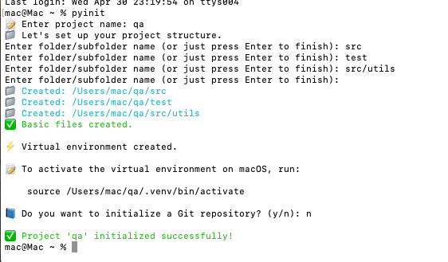

Here’s a complete “How To” guide to set up and run your pyinit CLI tool on any OS using pipx, with support for virtual environment creation and folder scaffolding.

⸻

✅ How to Set Up and Use pyinit CLI (Cross-Platform Guide)

📁 1. Clone the project

```
https://github.com/Martins-O/pyinit.git
```
⸻

🧰 2. Install pipx (if not installed)

> macOS or Linux:

> ``` brew install pipx ```        # macOS
> 
> ```python3 -m pip install --user pipx```
> 
> ```pipx ensurepath```

> Windows (via PowerShell):

> ``` python -m pip install --user pipx ```
> 
>  ``` pipx ensurepath ```

> Restart your terminal after pipx ensurepath.

⸻

🚀 4. Install pyinit using pipx

> In the terminal, navigate to the root of your pyinit project:

> ``` cd pyinit ```
> 
> ``` pipx install . ```

> ✅ This makes the pyinit command available globally.

⸻

✅ 5. Usage

>Now you can run pyinit from anywhere in your terminal:

> ``` pyinit ```

> It will:
>> -	Ask whether to create a new project or use an existing one.
>> -	If new: ask for project name, subfolders, etc.
>> -	If existing: ask for path and set up folders.
>> -	Create a Python virtual environment.
>> -	Display activation instructions.
>> -	(Optionally) auto-open a terminal for you.

⸻

💡 Notes
>> - To uninstall:

> ``` pipx uninstall pyinit ```

⸻

Usage Example:
> 